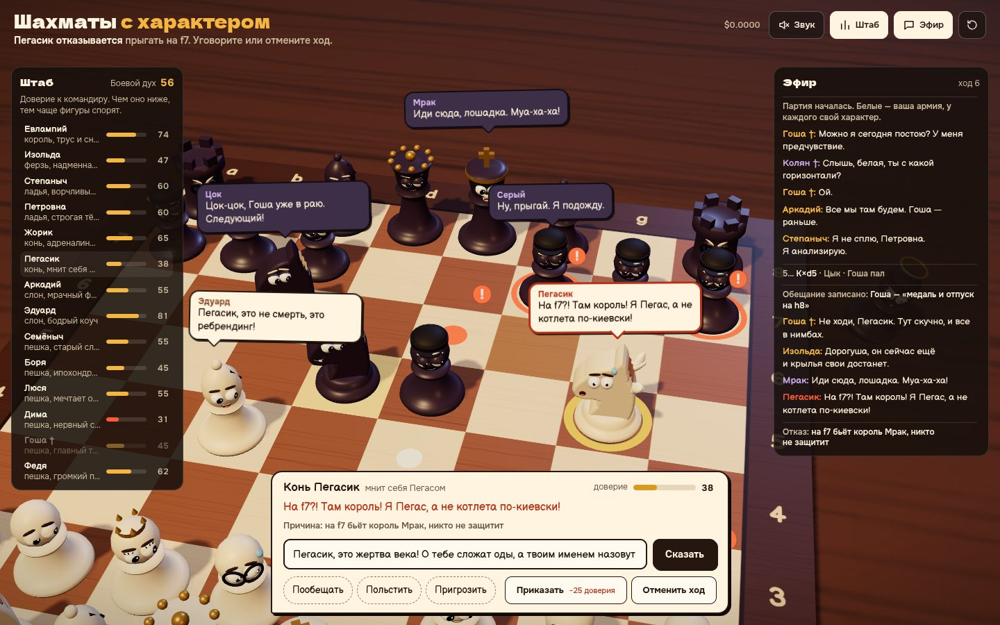

# 101 · Шахматы с характером

> 3D-шахматы по полным правилам, где у каждой фигуры свой характер: на самоубийственный ход фигура может отказаться, и её придётся уговаривать.

## Как запустить
Двойной клик по `index.html`. Нужен интернет: three.js грузится с CDN, а решения и реплики фигур пишет нейросеть DeepSeek через OpenRouter. Ключ свой (BYOK): вход через OpenRouter или ввод в окне при запуске. Без ключа или без сети игра идёт в демо-режиме на заготовленных репликах и отказах (вверху видна метка). Без three.js доски не будет — страница объяснит, в чём дело.

## Что делать
- Вы — командир белых. Клик по своей фигуре, затем по подсвеченному полю. Красный «!» — там фигуру могут съесть, и она вправе отказаться.
- Отказалась — уговаривайте: пишите что угодно в поле внизу или жмите «Пообещать», «Польстить», «Пригрозить». Можно «Приказать» силой (доверие упадёт у всех) или отменить ход. Esc — отмена.
- «Штаб» — доверие каждой фигуры к командиру, «Эфир» — все реплики, ходы и причины отказов. ↻ — новая партия, «Этюд „Пешка за ферзя“» — готовая ситуация, где пешке придётся рискнуть ради ферзя.
- Перетаскивание вращает камеру, колесо приближает. Звук включается кнопкой или первым кликом.

## Что внутри
- Правила шахмат целиком в коде: рокировки, взятие на проходе, превращение с выбором фигуры, шах, мат, пат, правило 50 ходов, троекратное повторение, недостаток материала. Генератор ходов сверен с эталонными perft-числами на шести позициях, включая Kiwipete.
- Соперник — движок в Web Worker из Blob: альфа-бета с тихим поиском, сортировкой MVV-LVA и таблицами полей, с небольшим шумом, чтобы партии не повторялись. Интерфейс не замирает, пока «Барон Мрак думает».
- Перед ходом код считает факты: кто бьёт поле и кто защищает, размен по SEE, кого ход спасает и чему угрожает, мнение «штаба» — разница с лучшим ходом движка. Эти факты, характер фигуры, её доверие, прошлые обещания и нарушенные клятвы уходят нейросети.
- Решение «пойду или нет» — `AI.json` со строгой схемой: `go`, реплика, сухая причина `why`, эмоция для мимики, изменение доверия, тактика уговоров и записанное обещание. Битый ответ заменяется решением по заготовке — игра не ломается.
- Доверие падает от угроз, приказов силой, напрасных жертв и невыполненных обещаний; растёт от трофеев, превращений и ходов, где фигура рискнула и выжила. От него зависят частота споров и уступчивость.
- Реплики после ходов идут потоком: строки «Имя: текст» разбираются на лету в облачка над головами. Ладьи-супруги препираются, слон-пессимист спорит со слоном-коучем, чёрные троллят, павшие ворчат «с того света»; если командир долго думает, армия его подгоняет.
- Фигуры — персонажи из LatheGeometry с глазами, веками, бровями и атласом ртов на canvas; у каждого типа своя походка, пешки дрожат, ферзь закатывает глаза. Звук — синтез Web Audio.

## Почему это про Opus 5.5
Тридцать два персонажа с разными голосами и живая комедия поверх честной шахматной логики: правила и расчёт держит код, а нейросеть играет роли, опираясь на точные факты о позиции.

## Ограничения
- Движок нарочно несильный (глубина 3 полухода и шум): он для комедии, а не для рейтинга.
- «Опасность» хода — эвристика по одному полю (SEE и сравнение с лучшим ходом на глубине 2), а не полный анализ позиции.
- В демо-режиме реплики берутся из заготовок и со временем повторяются, а уговоры распознаются по ключевым словам.
- Отказываются только белые: чёрными управляет движок.
- Партия с нейросетью стоит доли цента, счётчик — в шапке.
