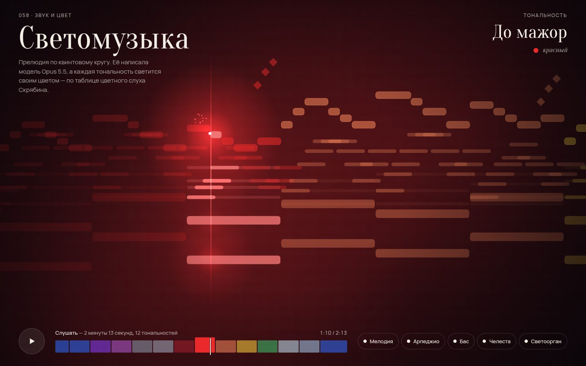

# 102 · Светомузыка

> Оригинальная прелюдия, написанная моделью, обходит все двенадцать мажорных тональностей по квинтовому кругу. Каждая тональность заливает зал своим цветом — по таблице цветного слуха Скрябина.

## Как запустить
Двойной клик по `index.html`. Пока не нажата кнопка «Слушать», партитура плывёт беззвучно — браузеры не разрешают звук без жеста пользователя.

## Что делать
- **«Слушать» или пробел** — пьеса звучит с начала (2 минуты 13 секунд). Повторное нажатие — пауза.
- **Клик по цветной ленте** внизу — перемотка. Каждый сегмент ленты — тональность, при наведении видно название.
- **Кнопки голосов** выключают мелодию, арпеджио, бас, челесту или «светоорган».

## Что внутри
- **Форма:** вступление на «мистическом» аккорде Скрябина от фа-диеза, затем двенадцать фраз по три такта (I – vi – V7 следующей тональности): каждая фраза заканчивается доминантой новой тональности, и музыка поднимается по квинтам через все двенадцать мажоров. Кода возвращается в фа-диез мажор.
- **Мелодия** — четыре рисунка (лирический, восходящий, кульминационный, лунный), которые модель расставила по драматургии: кульминация приходится на до, соль и ре мажор — красный, оранжевый и жёлтый.
- **Синтез без сэмплов:** рояль из негармонических обертонов с затуханием, зависящим от высоты; челеста; «светоорган» из расстроенных пил; реверберация зала на сгенерированной импульсной характеристике.
- **Анимация в духе Music Animation Machine:** ноты текут к линии «сейчас», звучащие вспыхивают, каждая фраза окрашена цветом своей тональности.
- **Цвета Скрябина:** до — красный, соль — оранжево-розовый, ре — жёлтый, ля — зелёный, ми и си — голубовато-белые, фа-диез — яркий синий, ре-бемоль — фиолетовый, ля-бемоль — пурпурно-фиолетовый, ми-бемоль и си-бемоль — стальные с металлическим блеском, фа — тёмно-красный.

## Почему это про Opus 5.5
Модель здесь и композитор, и звукорежиссёр, и художник по свету: гармонический план, голосоведение, синтез и визуал сделаны с нуля и согласованы между собой.

## Ограничения
- Таблицу Скрябина источники передают немного по-разному; здесь использован часто цитируемый вариант, оттенки подобраны на глаз.
- Звучит синтезатор, а не записанный рояль.
