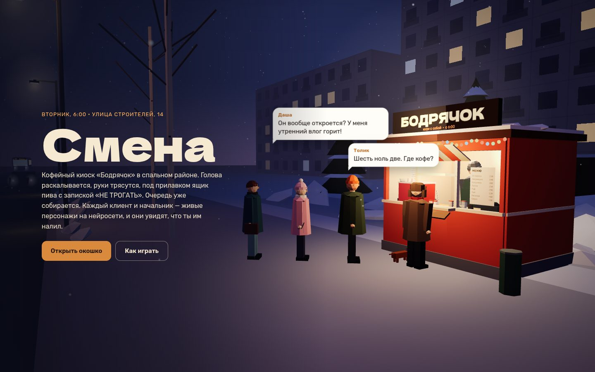

# 103 · Смена

> Кофейный киоск «Бодрячок» в спальном районе, шесть утра, бариста с похмелья. Всё готовится руками и всё можно испортить — а клиенты и начальник на нейросети видят, что им реально налили.

## Как запустить
Двойной клик по `index.html`. Нужен интернет: трёхмерный движок three.js грузится с CDN, а клиенты, шеф и дворник говорят через DeepSeek (OpenRouter). Ключ свой (BYOK): игра предложит войти через OpenRouter, вставить ключ или играть в демо-режиме на заготовленных репликах (вверху — метка «демо-режим»). Если нейросеть отвалится посреди смены (нет сети, ключ не подошёл, кончились деньги), игра сама перейдёт на заготовки и покажет ту же метку.

## Что делать
- **Заказ → приготовление → реакция.** Клиент подходит к окошку и говорит заказ, слева печатается чек с шагами. «Далее» (или Enter) открывает следующий шаг: стакан, имя маркером, помол, темпер, пролив, кипяток, молоко из холодильника, пар, заливка с рисунком, добавки, крышка. Шаги можно открывать и кликом по чеку или по предметам в киоске. «Выдать» — отдать как есть, хоть недоделанным.
- **Руки.** Помол, пар и кипяток — держать кнопку или пробел; темпер — поймать пузырёк уровня; пролив — остановить в зелёной зоне. Чем сильнее трясутся руки, тем сильнее пляшет стрелка и тем кривее сердечко на пенке.
- **Всё остальное** — импровизация и пакости: кефир вместо молока, соль, пиво в стакан, вода из-под крана, пепел, «правило пяти секунд», кукиш на пенке, любое слово на стакане.
- **Пиво** из ящика под прилавком (с запиской шефа «НЕ ТРОГАТЬ»): тремор уходит, камера плывёт, клиенты чуют запах. С первой бутылки можно отвечать клиентам и шефу своими словами, со второй пьяный текст заплетается, с третьей буквы на пакетах и банках пляшут, дальше — микросны и сон за прилавком.
- **Перекур** за киоском: нервы успокаиваются, время идёт втрое быстрее, очередь звереет, в окошке висит «ПЕРЕРЫВ». Там же дворник Ильдар с житейской философией — ему можно ответить.
- **Шеф звонит** и звереет от звонка к звонку. Можно сбросить — перезвонит злее. Если довести до бешенства, приедет раньше.
- **Финал** в 9:00: к киоску подъезжает чёрная машина. Нужно угадать тайного покупателя (или сказать, что его не было), потом шеф выносит вердикт, и печатается чек смены: выручка, отзывы, пиво Серёже, зарплата на руки.

## Что внутри
- **Скрытая правда о стакане.** Каждое действие записывается в состав напитка: граммы помола, качество темпера, секунды пролива, вид и температура молока, рисунок, сахар и соль, пиво, пепел, надпись, крышка, остывание. Из этого считается объективное качество и честное описание, которое целиком уходит клиенту-нейросети: «вместо молока — кефир, свернулся хлопьями; на стакане написано „Мишаня“».
- **Реплика и решение одним потоком.** Клиент отвечает в формате «РЕПЛИКА + JSON»: реплика печатается в облачке по мере прихода токенов, а JSON (звёзды, чаевые, платит ли, что делает со стаканом, жалуется ли шефу, отзыв на картах) проверяется кодом и при сбое заменяется разумными значениями. Решение и есть последствие: касса, чаевые, стакан в урну или кофе в снег, жалоба шефу.
- **Очередь всё видит.** Пиво под прилавком, перекур, вылитый в снег кофе попадают в журнал событий; стоящие в очереди получают его в свой промпт, комментируют и приходят к окошку уже с мнением. Кто не дождался — уходит и пишет отзыв; кто-то убегает на автобус.
- **Шеф** получает кассу, рейтинг, свежие отзывы, жалобы и число пропущенных звонков; его реплика готовится заранее, пока звонит телефон. Вердикт в конце считается с рассуждением модели (think). У каждого клиента утром своя история дня — её придумывает нейросеть при открытии смены.
- **3D на three.js:** панельки с окнами, которые загораются и гаснут, рассвет от ночного индиго до утра, фонари гаснут в 8:20, снег, автобус 47, машины, кошка на контейнере. Статика района слита в один меш с цветами вершин. Люди собраны из примитивов: брови и рот для эмоций, рука с локтем — клиент подносит стакан ко рту, бариста затягивается сигаретой, пар изо рта на морозе. Мини-игры считают по часам, а не по кадрам, разрешение подстраивается под скорость видеокарты.
- **Звук** синтезирован на Web Audio: кофемолка, пар, пролив, пшик бутылки, зажигалка, звонок шефа, «бубнёж» персонажей под текст.

## Почему это про Opus 5.5
Здесь нейросеть — не чат сбоку, а актёр, которому честно рассказали, что в стакане. Opus 5.5 спроектировал весь контур: состояние мира, из которого строится правда для модели, формат, который можно показывать потоком и одновременно проверять, и игру, где каждое решение игрока (даже самое идиотское) получает осмысленную реакцию.

## Ограничения
- Качество напитка — игровая модель, а не бариста-наука: зоны помола, пролива и температуры упрощены.
- Демо-режим без ключа работает на заготовках: реакции собираются из шаблонов по качеству и главному косяку, поэтому повторяются.
- Модель видит только текст: рисунок на пенке передаётся ей словами («кривоватое сердечко», «кукиш»).
- Смена длится около 10 минут реального времени; прогресс не сохраняется.
- Стоимость: проверочная живая сессия (три клиента, одна переделка, пиво, перекур с дворником, два звонка шефа и вердикт) — 18 запросов, $0,0033. Полную смену целиком с нейросетью не прогоняли; по этой пропорции она должна стоить 1–3 цента. Счётчик — вверху справа (на телефоне — в панели самочувствия).
