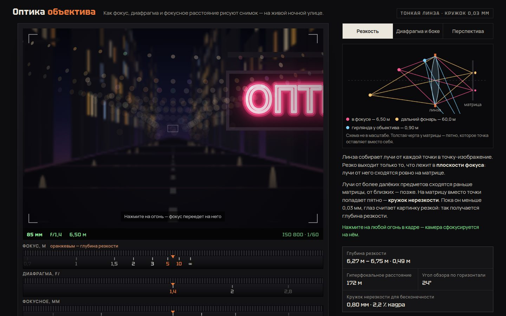

# 104 · Оптика объектива

> Ночная улица в видоискателе и три кольца настоящего объектива: фокус, диафрагма и фокусное расстояние меняют кадр так, как это делает оптика, — с кружками нерезкости, боке формы лепестков и «эффектом Хичкока».

## Как запустить
Двойной клик по `index.html`. Шрифты (Tektur, Manrope, Comfortaa) грузятся с Google Fonts; без сети подставятся системные.

## Что делать
- **Кольца** под видоискателем тянутся мышью или пальцем, крутятся колесом, реагируют на стрелки с клавиатуры. Фокусное и диафрагма защёлкиваются на стандартных значениях.
- **Клик по огню** в кадре — фокус переезжает на него, как при наведении пальцем на экране камеры.
- **Лепестки диафрагмы**: 5, 6, 7, 9 или круглая. На открытой диафрагме боке округляется, у краёв кадра срезается в «кошачий глаз».
- **Держать размер вывески** — камера отъезжает при увеличении фокусного, вывеска остаётся того же размера, а фон «прижимается» к ней.
- Вкладки справа — три коротких объяснения; лучевая схема и числа (глубина резкости, гиперфокальное, угол обзора) меняются вместе с кадром.

## Что внутри
- Сцена — улица в метрах: фасады с окнами, фонари, гирлянды, огни далёкого города, лампочки у самого объектива. Проекция — через угол обзора матрицы 36×24 мм.
- Кружок нерезкости по формуле тонкой линзы: c = A·|s − S|/s · f/(S − f), где A = f/N. Глубина резкости и гиперфокальное — по классическим формулам с допуском 0,03 мм.
- Геометрия улицы разбита на слои по глубине, каждый размыт своим кружком (сжатием-растяжением холста), слои сложены от дальних к ближним.
- Каждый огонь — точечный источник. Его пятно рисуется формой диафрагмы, а яркость делится на площадь (энергия сохраняется), наложения складываются аддитивно.
- Шкала глубины резкости на кольце фокуса, как на старых объективах.

## Почему это про Opus 5.5
Физика и объяснение в одном: формулы оптики не спрятаны, а прямо управляют картинкой, схемой и числами, и всё это можно покрутить руками.

## Ограничения
- Модель — тонкая линза без аберраций; хроматизм, дисторсия и «луковые кольца» в боке не моделируются.
- Геометрия размывается послойно, поэтому на стыках слоёв возможны мягкие переходы вместо точной глубины каждого пикселя.
- Лучевая схема не в масштабе: предметы — в логарифмической шкале, иначе далёкий фонарь не поместился бы на экран.
