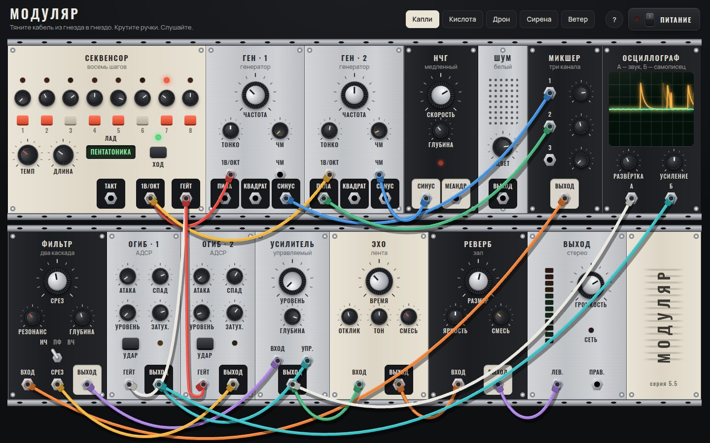

# 105 · Модуляр

> Модульный синтезатор в браузере: четырнадцать модулей в стойке, кабели провисают и покачиваются, а звук меняется, пока вы ещё тянете провод.

## Как запустить
Двойной клик по `index.html`, затем кнопка «Питание» — браузеры разрешают звук только после нажатия. Интернет нужен лишь для шрифтов Oswald и Manrope.

## Что делать
- **Кабель** — тяните из гнезда в гнездо. Выходы стоят на контрастной подложке; из одного выхода можно вести несколько кабелей.
- **Убрать кабель** — вытащите штекер из входа и отпустите в пустом месте или дважды щёлкните по гнезду.
- **Примерка** — пока кабель висит над подходящим входом, он уже подключён: соединение слышно до того, как вы отпустите кнопку.
- **Ручки** — тяните вверх и вниз (с Shift точнее), крутите колесом, двойной щелчок сбрасывает значение, стрелки на клавиатуре тоже работают.
- **Патчи** в шапке: «Капли», «Кислота», «Дрон», «Сирена», «Ветер».

## Что внутри
- Модули: секвенсор на восемь шагов с ладами, два генератора (пила, квадрат, синус, вход 1В/окт и ЧМ), НЧГ, шум, микшер, осциллограф, двухкаскадный фильтр (НЧ, полоса, ВЧ), две огибающие АДСР, управляемый усилитель, ленточное эхо, реверберация, стереовыход с индикатором уровня.
- Звук — только встроенные узлы Web Audio: сэмплов нет. Питч идёт через `detune`, поэтому вход 1В/окт точен (1 вольт = 1200 центов). Срез фильтра модулируется тоже в центах.
- Импульсная характеристика реверберации генерируется: затухающий шум с управляемой яркостью.
- Гейты событийные. Секвенсор и меандр НЧГ планируют фронты с упреждением 120 мс; огибающие реагируют с точностью до отсчёта.
- Кабель — верёвка из 18 точек на интеграторе Верле с жёсткими связями; концы приколоты к гнёздам.
- Без питания стойка всё равно живёт: секвенсор шагает, огибающие мигают, самописец осциллографа рисует рассчитанную огибающую.

## Почему это про Opus 5.5
Четырнадцать связанных модулей, звуковой граф, физика и точный планировщик в одном файле — это та же «длинная» инженерная работа, что и в тестах, где модель собирает прототипы и игры, только в мире синтезаторов.

## Ограничения
- Фильтр — два каскада биквадов, а не аналоговый «лестничный»: он звучит чище и не перегружается.
- У генераторов нет ШИМ и синхронизации.
- Гейт огибающей понимает только импульсы секвенсора («Гейт», «Такт») и меандр НЧГ, а не произвольный звуковой сигнал.
