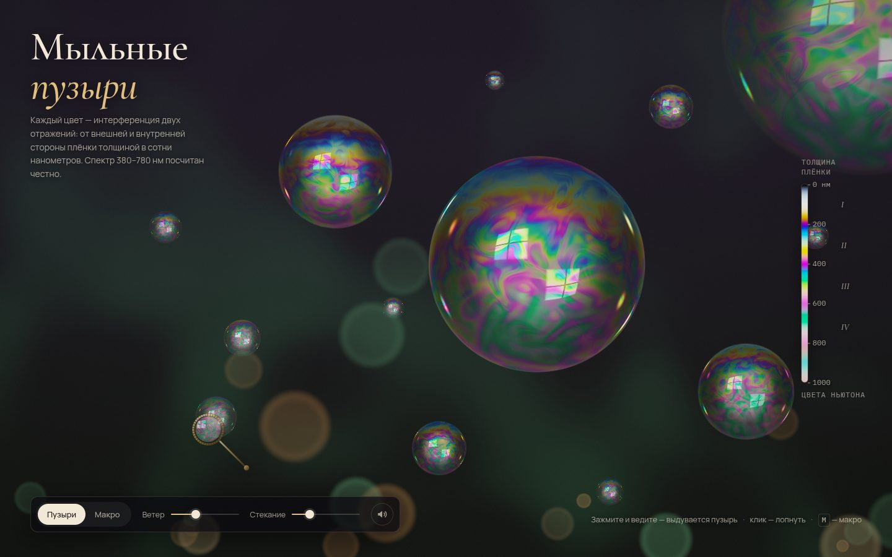

# 106 · Мыльные пузыри

> Интерференция в тонкой плёнке, посчитанная по спектру: цвета текут, плёнка стекает вниз, макушка чернеет — и пузырь лопается.

## Как запустить
Двойной клик по `index.html`. Нужен браузер с WebGL2 (Chrome, Safari, Firefox). Без интернета всё работает, только шрифты заменятся системными.

## Что делать
- **Зажмите кнопку мыши и ведите** — рамка выдувает пузырь. Держите на месте — пузырь раздувается; ведёте быстро — рвётся поток мелких.
- **Клик по пузырю** — лопнуть. Капли разлетаются от края отступающей плёнки.
- **Наведите на пузырь** — диаметр и толщина плёнки у макушки; маркер на шкале справа показывает её цвет.
- **Макро** (кнопка или `M`) — плёнка во весь экран. Ведите с зажатой кнопкой — «подуйте» и закрутите вихри. При наведении видна толщина в точке и порядок цвета Ньютона.
- Ползунки: **ветер** и **скорость стекания**; `Пробел` — выдуть пузырь с клавиатуры, `S` — звук.

## Что внутри
- **Таблица цветов.** Коэффициент отражения плёнки (n = 1,335) — формула Эйри для слоя в воздухе, отдельно для s- и p-поляризации: R = 2r²(1 − cos δ) / (1 + r⁴ − 2r² cos δ), где δ = 4π·n·d·cos θₜ / λ. Отражение считается для 101 длины волны от 380 до 780 нм и сворачивается с функциями цветового соответствия CIE 1931 (аппроксимация Уаймана — Слоана — Ширли) в таблицу «толщина 0–1400 нм × угол падения».
- **Чёрная плёнка — не текстура, а физика.** При толщине, стремящейся к нулю, δ → 0 и отражение гаснет само: два луча приходят в противофазе из‑за сдвига фазы на π на внешней границе.
- **Толщина плёнки меняется во времени**: стекание под тяжестью (к макушке тоньше), дифференциальное вращение полос, закрученные шумом вихри, тонкая стратификация у макушки. К концу жизни макушка истончается до чёрной плёнки.
- **Два отражения**: от внешней стенки и от внутренней стороны дальней стенки — отсюда маленькое перевёрнутое окно внутри пузыря.
- **Лопание**: отверстие раскрывается от макушки за ~0,1 с, вдоль отступающего края разлетаются капли; звук синтезирован из шума и короткого низкого тона.
- Сцена рендерится в HDR с мягким свечением бликов и тональной компрессией ACES.

## Почему это про Opus 5.5
Здесь нужно одновременно знать волновую оптику, колориметрию и GPU-программирование и связать их так, чтобы результат выглядел как фотография. Это ровно та междисциплинарная связка, на которой Opus 5.5 силён.

## Ограничения
- Пузыри — идеальные сферы в изометрической проекции; поток жидкости в плёнке имитирован шумом, а не решением уравнений тонкого слоя.
- Окружение (окно, огни сада) нарисовано процедурно, а не взято из реальной панорамы.
- Масштаб «1 px ≈ 0,4 мм» условный: он нужен только для подписи диаметра.
