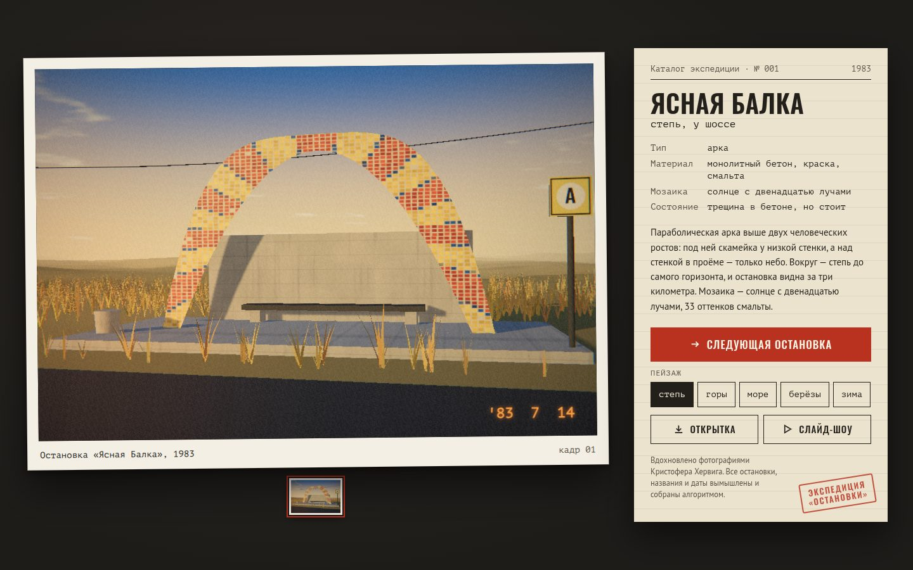

# 107 · Остановки

> Генератор советских модернистских автобусных остановок: бетонные раковины, арки, трубы и кольца со смальтой стоят в степи, горах, у моря, на берёзовой опушке и в снегу. Каждый кадр — как отпечаток с плёнки из экспедиции.

## Как запустить
Двойной клик по `index.html`. **Нужен интернет:** трёхмерный движок three.js загружается с cdn.jsdelivr.net. Без сети страница честно об этом скажет.

## Что делать
- **«Следующая остановка»**, стрелка → или пробел — новый кадр со щелчком затвора.
- **Пейзаж** (или клавиши 1–5): степь, горы, море, берёзы, зима.
- **Перетаскивание по фотографии** — немного обойти остановку.
- **«Открытка»** — скачать PNG с фотографией, подписью и штампом экспедиции.
- **«Слайд-шоу»** — новая остановка каждые семь секунд.
- Миниатюры под фотографией — уже снятые кадры; по клику кадр возвращается под своим номером.

## Что внутри
- **Десять архитектурных типов:** раковина, арка, волна, труба, гриб, складки, плиты с круглыми окнами, консольное крыло, кольцо, павильон. Формы — выдавленные профили, тела вращения и плиты с вырезами; у раковины и трубы торцы закрыты стенками по контуру свода.
- **Ракурс под тип:** камера встаёт с той стороны, откуда видны смальта и силуэт — у раковины, трубы и крыла сбоку, у арки и кольца почти в лоб, у плит и павильона слева.
- **Процедурная смальта:** мотив (солнце, волны, колосья, журавли, рыбы, орбиты…) рисуется векторно, затем раскладывается на кусочки с разбросом цвета, швами и выпавшими тессерами. У всех пяти палитр насыщенный фон, чтобы мозаика не сливалась с бетоном.
- **Процедурный бетон:** следы опалубки, потёки, краска, облупившаяся мелкими хлопьями.
- **Пейзажи:** рельеф с плоской площадкой у дороги, трава пучками из тонких травинок, линия электропередачи в степи, горы с воздушной перспективой, море с маяком, березняк, ельник и снегопад. Снег сам ложится на все поверхности, обращённые вверх.
- **Плёнка:** тональная кривая ACES, лёгкое выцветание, холодные тени и тёплые света, засветка по краю, виньетка, зерно и оранжевая дата, впечатанная камерой (зимой — зимний месяц, в остальных пейзажах — летний).
- **Каталог:** вымышленное название села (с правильными родами прилагательных), год, тип, материал, мотив мозаики, состояние, согласованное с отделкой, и короткое описание.

## Почему это про Opus 5.5
Процедурная генерация, у которой есть культурный контекст: формы, мозаики и тексты складываются в узнаваемый жанр, а не в случайный набор кубиков.

## Ограничения
- Все остановки, названия и даты вымышлены; реальные постройки не воспроизводятся.
- Первый кадр задан заранее (арка с солнцем в степи), дальше всё случайно.
- Архитектура упрощена до выдавленных профилей, у форм нет арматуры и швов бетонирования.
- На слабых видеокартах тени и постобработка могут снижать частоту кадров.
