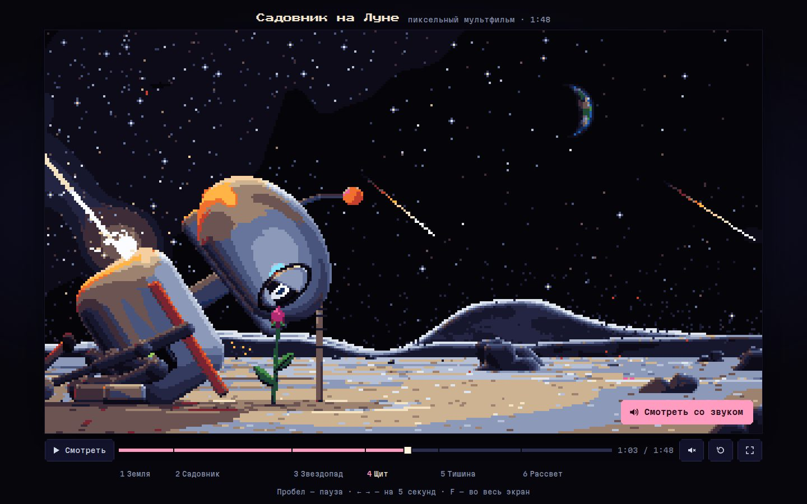

# 108 · Садовник на Луне

> Пиксельный мультфильм на 1 мин 48 с. Маленький робот каждую ночь ухаживает за единственным цветком на Луне. Начинается звездопад, и робот закрывает цветок собой.

## Как запустить
Двойной клик по `index.html`. Интернет нужен только для шрифтов плеера (Press Start 2P в заголовке, Martian Mono в кнопках). Без сети подставится моноширинный шрифт системы, а фильм и звук работают.

## Что делать
- Фильм начинается сам, без звука: так требует политика браузеров. Кнопка «Смотреть со звуком» перезапускает его с начала уже с музыкой.
- Пробел — пауза, ← → — на 5 секунд назад и вперёд, F — во весь экран, M — звук.
- Шкала разбита на шесть глав: «Земля», «Садовник», «Звездопад», «Щит», «Тишина», «Рассвет». Перематывать можно мышью или пальцем, клик по названию главы переносит в её начало. На компьютере названия глав стоят под своими отрезками шкалы, на телефоне — сеткой кнопок под плеером.
- В конце — затемнение, титр «КОНЕЦ» и кнопка «Смотреть ещё раз».

## Что внутри
- **Свой рендерер.** Кадр 320×180 собирается в G-буфер: альбедо, нормаль, глубина, свечение. Затем идёт освещение от направленных и точечных источников с тенями, свечение (bloom) и упорядоченный дизеринг по матрице Байера в палитру из 32 цветов. Пары цветов для дизеринга подобраны заранее для каждой ячейки куба 32³. На компьютере кадр увеличивается целым множителем, поэтому пиксели остаются чёткими; на телефоне он растягивается на всю ширину экрана.
- **Мир в метрах.** Камера перспективная: у неё есть фокусное расстояние, кран, панорама и телевик. Поэтому параллакс настоящий, а «восход Земли» в первом плане получается сам — от подъёма камеры из-за вала кратера. Робот нарисован примитивами с функциями расстояния (SDF) и чисто выглядит и на общем плане в 20 пикселей, и на крупном во весь кадр.
- **Свет Луны.** Реголит освещается по закону Ломмеля — Зеелигера, как настоящий лунный грунт: равнина остаётся светлой до горизонта даже под скользящим светом. Тени строятся лучом к источнику через силуэт робота или модуля, поэтому при каждой вспышке метеора они разворачиваются. На рассвете линия света бежит по равнине, а горы освещаются от вершин вниз.
- **Фильм как функция времени.** Робот, цветок, лейка, лёд и камера заданы ключевыми кадрами с упреждением, захлёстом и упругостью. Пружина антенны один раз интегрируется при загрузке и дальше читается из таблицы, поэтому перемотка точная. Метеоры потока летят параллельно, и в перспективе их следы расходятся из радианта. Выбросы летят по баллистическим дугам при лунной тяжести 1,62 м/с².
- **Звук.** Чиптюн на Web Audio: прямоугольные волны со скважностью 12,5, 25 и 50 %, треугольная волна баса, шум ударных и эффектов. Партитура стоит на той же шкале, что и действие: шаги робота ложатся на шестнадцатые доли при 120 ударах в минуту, каждая капля из лейки звучит нотой. Пока робот прячет цветок, звуки шторма глушатся фильтром.
- **Земля.** Материки нарисованы по упрощённым контурам в долготе и широте, облака — фрактальным шумом. Освещённая сторона серпа обращена к Солнцу, а на ночной стороне горят огни городов.

## Почему это про Opus 5.5
Одна программа здесь — это и сценарий, и раскадровка, и свет, и музыка. Модель сама придумала историю, поставила игру актёра и написала партитуру, синхронную с каждым шагом.

## Ограничения
- На настоящей Луне нет атмосферы, поэтому метеоры не оставляют светящихся хвостов. Хвосты здесь — художественная вольность. Вспышки при ударах о поверхность — реальное явление.
- Цветок растёт в вакууме, а капли воды не вскипают. Это сказка. Размер Земли на общих планах немного увеличен, а солнечный свет на рассвете «приподнят», чтобы золото было видно на плоском грунте.
- Контуры материков грубые: до нескольких градусов. Огни городов нанесены условно, по списку крупных агломераций.
- Кадр рисуется на процессоре: на загруженном двухъядерном сервере медиана — около 80 мс на кадр. На слабых машинах частота кадров падает, но время фильма идёт по часам (шаг до секунды), поэтому звук и картинка не расходятся.
- В телевике на рассвете гребни гор оставлены в тени: солнечная тень хребтов считается в экранном пространстве, и при семикратном увеличении подсвеченный гребень превращался в тонкую нить через кадр.
