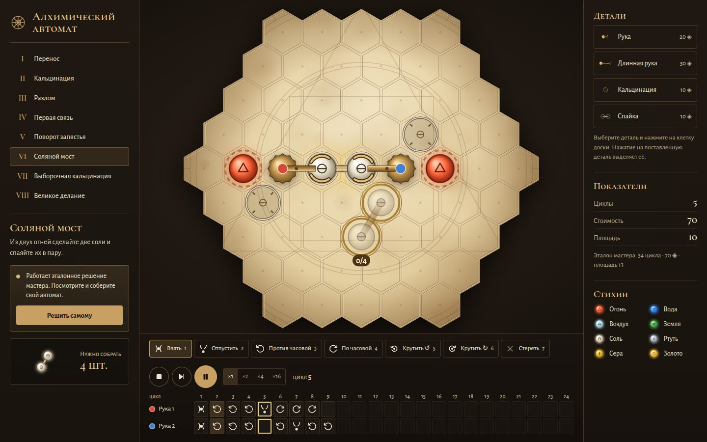

# 109 · Алхимический автомат

> Программируйте латунные руки на шестиугольной доске, чтобы собирать молекулы из стихий: восемь головоломок, от переноса соли до Великого делания.

## Как запустить
Двойной клик по `index.html`. Интернет нужен только для шрифтов.

## Что делать
1. При открытии работает **эталонное решение** задачи «Соляной мост». Кнопка «Решить самому» под описанием задачи очищает доску для вашего решения.
2. **Детали** (справа, на телефоне — сразу под доской): выберите руку или знак и нажмите на клетку доски. Нажатие на поставленную деталь выделяет её: `R` — повернуть, `Delete` — убрать.
3. **Программа** (снизу): у каждой руки своя дорожка на 24 цикла. Выберите команду (клавиши `1`–`7`) и нажимайте или протягивайте по клеткам. Правая кнопка стирает.
   - **Взять** / **Отпустить** — захват атома на конце руки.
   - **Против часовой** / **По часовой** — поворот руки на 60° вместе с молекулой.
   - **Крутить** — поворот молекулы вокруг захвата.
4. **Пуск** (пробел), **Шаг** (`S`), **Сброс** (`Esc`). Программа повторяется по кругу. Столкновения атомов, выход за край доски и молекула, которую тянут две руки, останавливают автомат и подсвечивают место ошибки.
5. После решения — три гистограммы: **циклы, стоимость, площадь** ваших последних решений этой задачи, пунктиром — эталон мастера.

## Задачи
I Перенос · II Кальцинация · III Разлом · IV Первая связь · V Поворот запястья · VI Соляной мост · VII Выборочная кальцинация · VIII Великое делание.

## Что внутри
- `sim.js` — чистая логика без отрисовки: осевые координаты шестиугольников, повороты молекул вокруг основания и захвата, связность молекул через связи, знаки (кальцинация, спайка, распайка, сплав трёх начал в золото), приём готовых молекул на выходе, подсчёт показателей.
- Эталонные решения всех восьми задач прогоняются тем же симулятором в Node. Поэтому каждая задача гарантированно решаема, а цифры эталона честные.
- `app.js` — пергаментная доска с пятнами, выжженным краем и гравированной «квадратурой круга», латунные руки с шестернями, светящиеся атомы с классическими алхимическими символами. Каждый цикл плавно интерполируется: дуги поворота, раскрытие захвата, вспышки знаков, растворение молекул на выходе. Доска перерисовывается только во время движения и после правок.
- Решения и история сохраняются в браузере.

## Почему это про Opus 5.5
Игровой дизайн, строгая симуляция и доказанная решаемость: каждая головоломка проверена автоматически, а не на глаз.

## Ограничения
- Столкновения проверяются в конце цикла, а не во время дуги поворота.
- Нет поршней и растяжимых рук. Показатели сравниваются с эталоном автора, а не с мировой статистикой — её здесь неоткуда взять.
