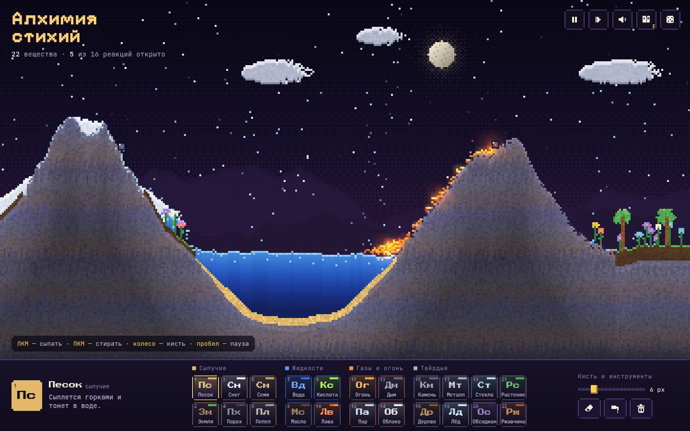

# 110 · Алхимия стихий

> Пиксельная песочница из 22 веществ: вулкан кипятит озеро, пар собирается в тучи, дождь поливает сад — а 16 реакций нужно открыть самому.

## Как запустить
Двойной клик по `index.html`. Интернет нужен только для пиксельного шрифта Pixelify Sans, без него работает системный моноширинный.

## Что делать
- **ЛКМ** — сыпать выбранное вещество; кисть можно держать на месте, и вещество будет литься.
- **ПКМ** или **E** — стирать. **Колесо**, `[` и `]` меняют размер кисти.
- **F** — «кран»: клик ставит бесконечный источник выбранного вещества, повторный клик рядом его убирает.
- **Пробел** — пауза, **точка** — один шаг, **J** — журнал реакций, **N** — новый мир.
- Палитра внизу собрана как таблица Менделеева: сыпучие, жидкости, газы и огонь, твёрдые.

## Что внутри
- Клеточный автомат на typed arrays: тип, оттенок, «данные» (жизнь огня, влажность земли, жар металла, запас роста) и отметка кадра, чтобы клетка не ходила дважды за шаг.
- Обход снизу вверх с чередованием направления строк, плотности для всплытия и тонущих веществ, растекание жидкостей с разной вязкостью.
- Круговорот воды: лава превращает воду в пар и обсидиан, пар поднимается и собирается в облака, облака проливаются дождём, земля впитывает воду, семена на сырой земле прорастают цветами.
- Горение с разными видами топлива: масло вспыхивает, дерево тлеет углями и оставляет пепел, порох даёт цепные взрывы с разлётом обломков и тряской кадра.
- Металл копит и передаёт жар соседям и светится от тёмно-красного до белого, в воде ржавеет.
- Свечение лавы, огня и углей — отдельный буфер, размытый двумя уменьшенными копиями; звуки взрывов, шипения и открытий синтезированы в Web Audio.

## Почему это про Opus 5.5
Сотни правил взаимодействия, которые должны работать вместе и не ломать друг друга, — это длинная задача на аккуратность, а не на один эффектный трюк.

## Ограничения
Физика условная: температуры как поля нет, жар передаётся соседям по правилам. Открытые реакции хранятся в `localStorage` этого браузера. На очень больших экранах клетка крупнее (до 6 px), чтобы держать 60 кадров в секунду.
