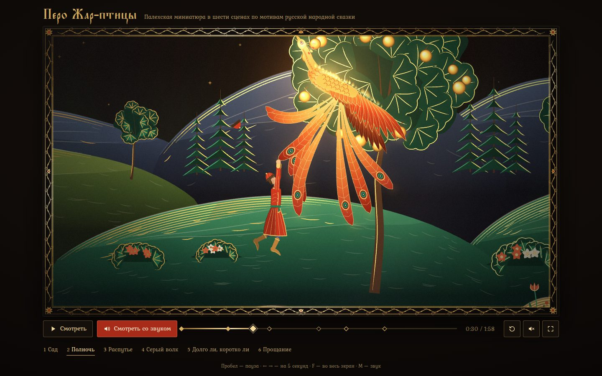

# 111 · Перо Жар-птицы

> Двухминутный мультфильм в технике палехской лаковой миниатюры: чёрный лак, золото, темпера — и перо, которое горит живым огнём.

## Как запустить
Двойной клик по `index.html`. Интернет нужен только для шрифтов Kurale и Ponomar; без него подставятся системные шрифты с засечками, а фильм и звук работают полностью.

## Что делать
- Фильм начинается сам, без звука. Кнопка «Смотреть со звуком» перезапускает его с начала уже со звуком: гусли, свирель, колокольчики.
- Пробел — пауза, ← → — на 5 секунд, Home — в начало, F — во весь экран, M — звук.
- Шкала времени с ромбами сцен: клик или перетаскивание. Под кадром — шесть сцен, клик по названию переходит к сцене.

## Что внутри
- Кадр — чистая функция времени `renderFilm(ctx, base, t)`: таймлайн из 23 планов, ключевые кадры с easing, камера с наездами и панорамами, наплывы и затемнения. Перемотка в любую точку даёт тот же кадр.
- Палехский набор на Canvas 2D: горки-лещадки с золотой штриховкой, деревья-веера, терем, орнаментальная рамка, клейма с килевидным верхом. Каждая картина — список штрихов переменной ширины. Прорисовка ведёт кисть по длине штриха, на кончике — «мокрый» золотой блик.
- Персонажи — скелетные куклы: Иван, братья, царь, Елена, стража, волк, кони, Жар-птица. Позы плавно смешиваются; есть упреждение, захлёст, сжатие в прыжке. Огонь пера — языки пламени вдоль кромки, искры и отсвет на золоте. Отсвет ложится в порядке рисования, поэтому стена терема закрывает и штрих, и его блеск.
- Звук синтезирован на Web Audio. Гусли — струна Карплуса — Стронга с щипком у подставки, свирель — осциллятор с дыханием, форшлагами и вибрато, колокольчики — негармонические парциалы. К ним добавлены копыта, лапы, взмахи крыльев, вой волка, сверчки и зал-реверберация.
- Партитура — около 1300 событий по времени фильма в том же темпе, что и монтаж: 96 ударов в минуту, такт 1,25 с. Шаги и копыта вычислены из фаз походки, колокольцы звенят в крайних точках качания. Часы звука ведут картинку, поэтому после паузы и перемотки всё снова совпадает.
- Сюжет — народная сказка об Иване, Жар-птице и сером волке, пересказанная своими словами в шести сценах. «Долго ли, коротко ли» показано как житийная икона с клеймами: застывший кадр уменьшается в первое клеймо, камера обходит остальные.

## Почему это про Opus 5.5
Один исполнитель держит в голове сразу режиссуру, стилизацию под конкретную школу народного искусства, скелетную анимацию, звукосинтез и музыку. Всё это сведено в одну функцию времени так, что картинка и партитура не расходятся.

## Ограничения
- Персонажи плоские, как на лаковой миниатюре, анимация кукольная. Лица в профиль, кроме крупных планов Ивана.
- Середина сказки — конь златогривый и Елена Прекрасная — сжата в монтаж клейм и подробно не показана.
- Звук синтетический: гусли и свирель узнаваемы, но это не запись живых инструментов, а «зал» — сгенерированный импульсный отклик.
- На слабых машинах разрешение холста снижается автоматически.
