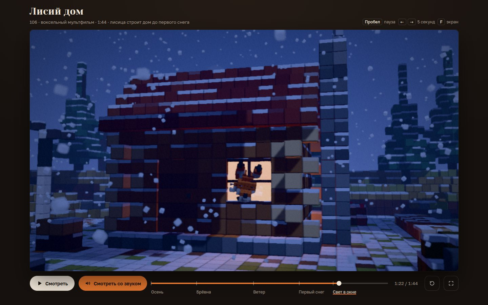

# 113 · Лисий дом

> Воксельный мультфильм на 1:44: лисица до первого снега строит дом из брёвен, чинит сорванную ветром крышу и успевает — в окне загорается свет.

## Как запустить
Двойной клик по `index.html`. Нужен интернет: трёхмерный движок three.js 0.170 загружается с jsDelivr, шрифты — с Google Fonts. Без сети фильм не запустится и скажет об этом прямо в кадре, шрифты заменятся системными.

## Что делать
- Фильм сам идёт без звука. «Смотреть со звуком» запускает его с начала уже со звуком; повторное нажатие выключает и включает звук.
- Пробел — пауза, ← и → — на 5 секунд, F — во весь экран, M — звук, клик по кадру — пауза.
- На шкале времени метки пяти сцен: «Осень», «Брёвна», «Ветер», «Первый снег», «Свет в окне». На телефоне сцены идут списком под кадром.

## Что внутри
- **Фильм — функция времени.** Поза лисы, брёвна, доски, листва, снег, свет, камера и звук вычисляются из `t`, поэтому перемотка в любую точку даёт тот же кадр. Кривые ветра, снегопада и огня общие для картинки и звука.
- **Лиса — кукла на суставах**: бёдра, грудь, голова с челюстью, ушами и глазами, лапы из 2–3 звеньев, хвост из 5 звеньев. Два десятка поз (сон, потягивание, рысь с бревном в зубах, бросок, удары молотком, шлепок на крышу, чих) сводятся ключами с плавностями, рысь строится из пройденного пути, есть сжатие и растяжение, упреждение перед прыжком. Захлёст хвоста — затухающая пружина: её раскачивают отрыв, приземление, торможения и повороты. Она предрассчитана на весь фильм с шагом 10 мс и потому тоже функция `t`. Уши отстают от кивков.
- **Воксели** — InstancedMesh с общим шейдером: фаска и шов по краю кубика, снег и опавшая листва на верхних гранях, кроны качаются от ветра. Мир — процедурная диорама: рельеф с ручьём, три десятка деревьев, руины дома, поленница.
- **Камера — монтажный лист из 28 планов**: облёт стройки, наезды, ведение за лисой и за её головой, тряска в бурю, «ручная» камера. Постобработка: глубина резкости по буферу глубины («макросъёмка игрушки»), мягкие тени, свечение, тоновая компрессия, грейдинг «осень → буря → первый снег → синяя ночь», зерно, виньетка.
- **Снег и листопад** — частицы на GPU: положение зависит от времени и «семени» частицы, облако заворачивается вокруг камеры, снос считается по интегралу ветра.
- **Звук на Web Audio**: гитара по алгоритму Карплуса — Стронга (перебор, «тревис», бой, тремоло) с темой на 7 тактов, колокольчики, гул бури, ветер, треск очага и шумы по меткам сценария: шаги по листве, дереву и снегу, молоток, удары брёвен, чих. Ноты планируются по часам AudioContext, при перемотке расписание пересобирается.

## Почему это про Opus 5.5
Мультфильм написан кодом без единого ассета: сюжет, игра персонажа, режиссура и партитура сведены на одну шкалу времени и выверены глазами — по листам кадров из всех сцен.

## Ограничения
- Без интернета не работает: three.js грузится с CDN.
- Анимация ключевая, без инверсной кинематики: лапы не «прилипают» к опоре и могут проскальзывать.
- Звук включается только кнопкой (так требуют браузеры), поэтому при открытии фильм идёт без звука.
- Если кадры не успевают, разрешение автоматически снижается до 55 %. На телефоне фильм тяжёлый: тени и глубина резкости рассчитаны на ноутбук.
