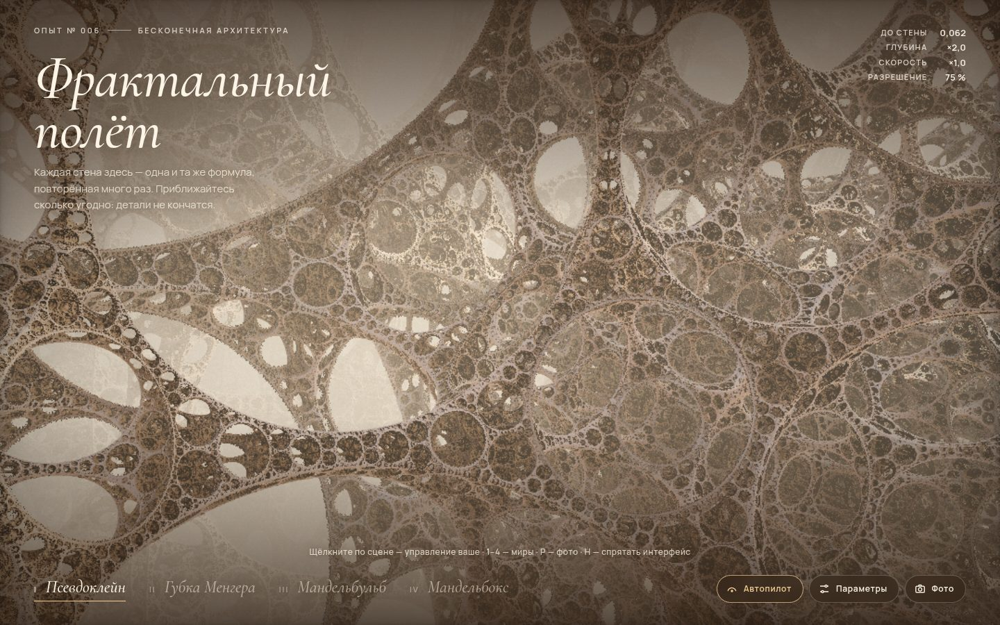

# 114 · Фрактальный полёт

> Кинематографичный полёт сквозь бесконечную архитектуру 3D-фракталов: кружевной собор псевдоклейна, коридоры губки Менгера, Мандельбульб и резной Мандельбокс.

## Как запустить
Двойной клик по `index.html`. Нужен браузер с WebGL 2 (Chrome, Safari, Firefox). Интернет нужен только для шрифтов — без него сцена работает с системными.

## Что делать
- Просто смотрите: автопилот сам ведёт камеру, каждые 30 секунд — новый мир.
- Щёлкните по сцене — управление ваше: **WASD** — полёт, мышь — взгляд, **Shift** — быстрее, **Q / E** — вниз и вверх, колесо — скорость, **Esc** — отпустить курсор.
- **1–4** — миры, **P** — фоторежим (48 проходов сглаживания и сохранение PNG), **H** — спрятать интерфейс, **R** — вернуться к началу.
- «Параметры»: масштаб или степень фрактала, итерации, дальность тумана, высота и азимут солнца, мягкие тени.
- На телефоне: ведите пальцем — осмотреться, кнопка «Вперёд» — лететь.

## Что внутри
- Raymarching по функциям расстояния для четырёх фракталов: псевдоклейновская группа (складка коробки + инверсия в сфере), бесконечная решётка губок Менгера, Мандельбульб степени 8 и Мандельбокс.
- Автопилот на процессоре: те же функции расстояния продублированы в JS. Камера держит «коридор» расстояний до стен, объезжает препятствия по градиенту поля расстояний и медленно блуждает по шуму. Маршруты проверены симуляцией: 90–97 % времени камера остаётся в коридоре.
- Масштаб тумана, теней и ambient occlusion следует за расстоянием до стен, поэтому картинка одинаково хороша на любой глубине погружения.
- Мягкие тени, AO, небо с солнцем, окраска по орбитальным ловушкам, тонмаппинг ACES, зерно плёнки.
- Разрешение подстраивается под время кадра; фоторежим копит 48 кадров с субпиксельным дрожанием для сглаживания.

## Почему это про Opus 5.5
3D-сцена и математика фракталов в одном шейдере — плюс инженерный цикл: ракурсы подбирались черновым CPU-трассировщиком, автопилот проверялся симуляцией, а финальная картинка — по скриншотам.

## Ограничения
- Шейдер тяжёлый: на слабой видеокарте разрешение автоматически падает и картинка становится мягче.
- На очень большой глубине упираемся в точность float32 — мелкие детали начинают «сыпаться».
- Мандельбокс облетается снаружи: вплотную к его фасаду raymarching даёт артефакты, поэтому автопилот держит дистанцию.
