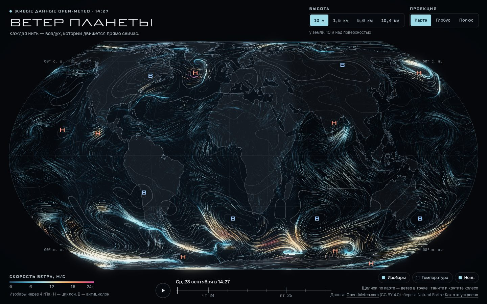

# 115 · Ветер планеты

> Живой ветер Земли по данным Open-Meteo: светящиеся нити текут по карте на четырёх высотах — от 10 метров над землёй до струйных течений на 10 километрах.

## Как запустить
Двойной клик по `index.html`. Нужен интернет: ветер приходит одним запросом к Open-Meteo (ключ не нужен), шрифты — с Google Fonts. Без сети карта не пустеет: береговые линии встроены в код, а вместо живых данных включается иллюстративная модель общей циркуляции с подписью «иллюстративные данные». Открыть модель специально можно по адресу `index.html#demo`.

## Что делать
- Щелчок (касание) по карте — карточка точки: скорость и направление ветра на четырёх высотах, температура, давление, погода, порывы и график ветра на 48 часов. Для точки отдельно запрашивается прогноз Open-Meteo.
- «Высота»: 10 м у земли, 1,5 км (850 гПа), 5,6 км (500 гПа), 10,4 км (250 гПа, струйные течения).
- «Проекция»: карта Equal Earth, глобус, полярная карта. Повторное нажатие «Полюс» переключает на южное полушарие.
- Тяните карту и крутите колесо — поворот и масштаб; на телефоне — пальцами. Двойной щелчок приближает.
- ▶ — прогноз на двое суток: циклоны смещаются, граница дня и ночи ползёт по карте.
- Слои: изобары с центрами циклонов (Н) и антициклонов (В), температура у земли (нити становятся белыми), ночная сторона.
- Клавиши: пробел — воспроизведение, ← и → — час, ↑ и ↓ — высота, Esc — закрыть карточку.

## Что внутри
- **Сетка под лимит.** 514 точек «редуцированной» сетки: 20 рядов через 9°, в ряду около 40·cos φ точек, шаг около 1000 км. Бесплатный API считает каждую точку отдельным вызовом, лимит — 600 в минуту, поэтому вся Земля укладывается в один POST-запрос: 10 переменных × 49 часов, около 470 КБ. Ответ полчаса хранится в браузере (IndexedDB), так что перезагрузка страницы лимит не тратит.
- **Сплайны по сфере.** Скорость и направление превращаются в трёхмерные векторы, поэтому у полюса нет особой точки. Сплайн Катмулла — Рома идёт сначала вдоль рядов, потом по широте; за полюсом ряд продолжается на противоположном меридиане. Результат — текстура поля 360 × 181.
- **Частицы на видеокарте.** Около 21 тысячи частиц (на телефоне — 10 тысяч) делают шаг вдоль ветра прямо по сфере. Хвост — кольцевой буфер из 24 положений (путь примерно за 0,8 секунды) в географических координатах, поэтому следы не рвутся при повороте глобуса, масштабе и перетекании проекций.
- **Отрисовка.** Подложка — обратная проекция каждого пикселя (для Equal Earth — метод Ньютона), кешируется, пока вид не меняется. Нити рисуются в буфер с плавающей точкой и сглаживанием MSAA, яркость сжимается с сохранением оттенка, сверху — мягкое свечение.
- **Синоптика.** Изобары через 4 гПа строятся «марширующими квадратами», центры циклонов и антициклонов — локальные экстремумы давления. Ночная сторона считается по положению Солнца для выбранного часа.
- **Запасной режим.** Модель общей циркуляции: пассаты, западный перенос, волны Россби в струйных течениях, циклоны и антициклоны с правильным направлением вращения в каждом полушарии. Скорости на всех высотах подогнаны к распределению реальных данных.

## Почему это про Opus 5.5
Работа с живыми данными целиком: лимиты API проверены запросами, сетка подобрана под лимит, данные интерполированы по сфере и превращены в физику на видеокарте. Там, где данные сглажены или иллюстративны, об этом сказано прямо.

## Ограничения
- Шаг сетки — около 1000 км. Крупные циклоны видны, а ураганы и узкие фронты сглажены; метки Н и В стоят по сглаженному полю, а в центрах настоящих циклонов давление ниже, чем на сетке. Прогноз для точки по щелчку запрашивается отдельно и сетку не использует.
- Высоты 1,5, 5,6 и 10,4 км — средние высоты уровней 850, 500 и 250 гПа в стандартной атмосфере; реальная высота этих уровней меняется с погодой.
- Бесплатный API Open-Meteo пропускает около 600 точек в минуту с одного адреса. Если лимит исчерпан, страница показывает иллюстративную модель и сама повторяет запрос через минуту.
- Береговые линии Natural Earth 1:50 млн упрощены до 22 тысяч точек, шельфовые ледники Антарктиды не показаны.
- Положение Солнца для ночной стороны — упрощённые формулы с точностью около градуса.
- На слабых видеокартах плотность пикселей автоматически снижается до 1,5 или 1.
