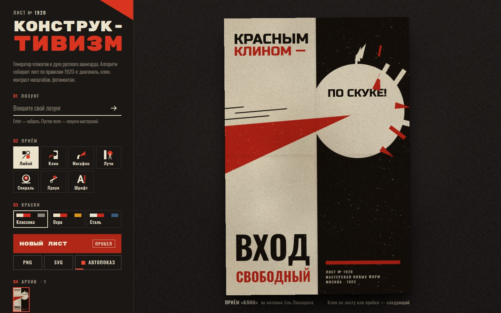

# 116 · Конструктивизм

> Плакатная мастерская: алгоритм собирает лист по правилам русского авангарда 1920-х — диагональ, клин, контраст масштабов, фотомонтаж.

## Как запустить
Двойной клик по `index.html`. Шрифты (Rubik Mono One, Dela Gothic One, Russo One, Oswald) грузятся с Google Fonts; без интернета плакаты собираются системными гротесками.

## Что делать
- Клик по плакату или **пробел** — новый лист; **← →** — листать архив.
- **Лозунг** — впишите свой и нажмите Enter: вёрстка сама разобьёт строки, растянет каждую на ширину блока и выберет акцент.
- **Приём** — шесть композиций: «Клин» (Лисицкий), «Мегафон» (Родченко), «Лучи» (Клуцис и башня Шухова), «Спираль» (братья Стенберг), «Проун» (Лисицкий и Малевич), «Шрифт» (наборные листы).
- **Краски** — «Классика», «Охра», «Сталь».
- **PNG** — лист 1800 × 2700 с бумагой и износом краски; **SVG** — чистый вектор со шрифтами.
- **Автопоказ** включён при открытии и выключается при любом ручном действии.

## Что внутри
- Плакат — список примитивов в координатах 600 × 900: многоугольники, круги, дуги, штриховка, текст, точки растра. Один список рисуется на Canvas с анимацией сборки и сериализуется в SVG.
- Вёрстка текста на ограничениях: короткие предлоги «приклеиваются» к следующему слову, разбиение на строки подбирается перебором, каждая строка растягивается на ширину по реальным границам глифов (`actualBoundingBox`).
- Буквы в раструбе мегафона растут геометрической прогрессией; коэффициент роста подбирается бисекцией так, чтобы слово точно заполнило конус.
- Фотомонтаж — полутоновый растр под 45°: профиль головы, глаз, шар; тон задан функцией освещения, радиус точки ∝ √темноты.
- Бумага — процедурная: волокна, пятна, сгибы, виньетка; краска кладётся умножением, по ней проходит маска износа, красный слой смещён на долю пункта (несовмещение печати).
- Башня Шухова собрана из прямых стержней: каждая секция — гиперболоид с закрученными образующими.

## Почему это про Opus 5.5
Вкус в дизайне плюс алгоритмическая точность: композиции 1920-х разобраны на правила и превращены в генератор, который никогда не повторяется, но всегда выглядит собранным.

## Ограничения
- Это стилизация по мотивам, а не копии плакатов; исторические листы не воспроизводятся.
- Очень длинные лозунги (больше 60 знаков) дают мелкий кегль.
- В SVG нет текстуры бумаги и износа (только лёгкое зерно-фильтр), шрифты подключаются с Google Fonts.
