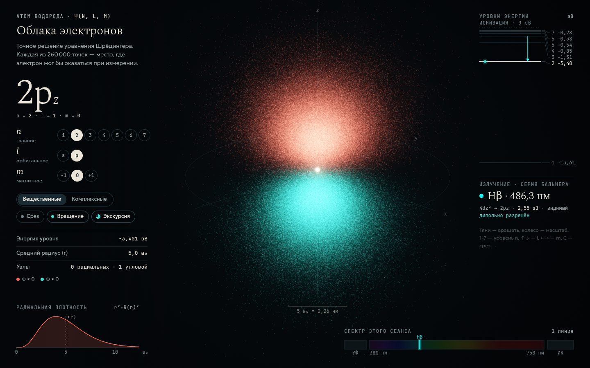

# 117 · Облака электронов

> Орбитали атома водорода, посчитанные по точным волновым функциям ψ(n, l, m): сотни тысяч точек, знак и фаза, узлы, фотоны и спектр.

## Как запустить
Двойной клик по `index.html`. Интернет нужен только для шрифтов — без него всё работает на системных.

## Что делать
- Тянуть мышью — вращать облако, колесо или щипок — масштаб, двойной клик — сброс.
- Кнопки n, l, m или клавиши: `1–7` — главное число n, `↑`/`↓` — l, `←`/`→` — m.
- «Вещественные / Комплексные» — базис орбиталей: цвет показывает знак ψ или её фазу от 0 до 2π.
- «Срез» (`C`) — разрезает облако плоскостью через ядро, и становятся видны радиальные узлы.
- «Экскурсия» — автотур по 14 орбиталям. Все переходы в нём с изменением n дипольно разрешены, и за круг в спектре собирается серия Бальмера от Hα до Hε.

## Что внутри
- Радиальная часть — обобщённые полиномы Лагерра, угловая — присоединённые функции Лежандра (рекуррентные формулы).
- |ψ|² раскладывается в произведение по r, θ, φ, поэтому каждая точка сэмплируется точно: три независимых обращения табулированных функций распределения, без отбраковки.
- Смена уровня испускает или поглощает фотон с длиной волны по формуле Ридберга (R_H = 1,0967758·10⁷ м⁻¹, с приведённой массой). Цвет линии берётся по длине волны, УФ и ИК помечены отдельно.
- Правило отбора не зашито таблицей: угловой дипольный матричный элемент ⟨b|r̂|a⟩ считается численно по сфере, поэтому ответ корректен и для вещественных орбиталей.
- Рендер: сотни тысяч точек с аддитивным смешением в HDR-буфер (RGBA16F), двухпроходное гауссово свечение, экспоненциальная тональная компрессия, дизеринг. При тяжёлом кадре разрешение понижается само.
- Диаграмма уровней — в честном линейном масштабе энергии. Подписи разведены выносками, потому что уровни с n ≥ 3 сливаются у границы ионизации.

## Почему это про Opus 5.5
Междисциплинарная точность (HLE — 67,7 %): квантовая механика, численные методы и GPU-графика в одном файле. Здесь каждая красивая деталь — следствие формулы, а не декорация.

## Ограничения
- Нерелятивистский водород: без тонкой структуры, спина и лэмбовского сдвига.
- Облако показывает плотность вероятности, а не «траекторию» электрона. Точки — это выборка, не движение.
- Длины волн даны для вакуума: Hα = 656,5 нм, в воздухе — 656,3 нм.
