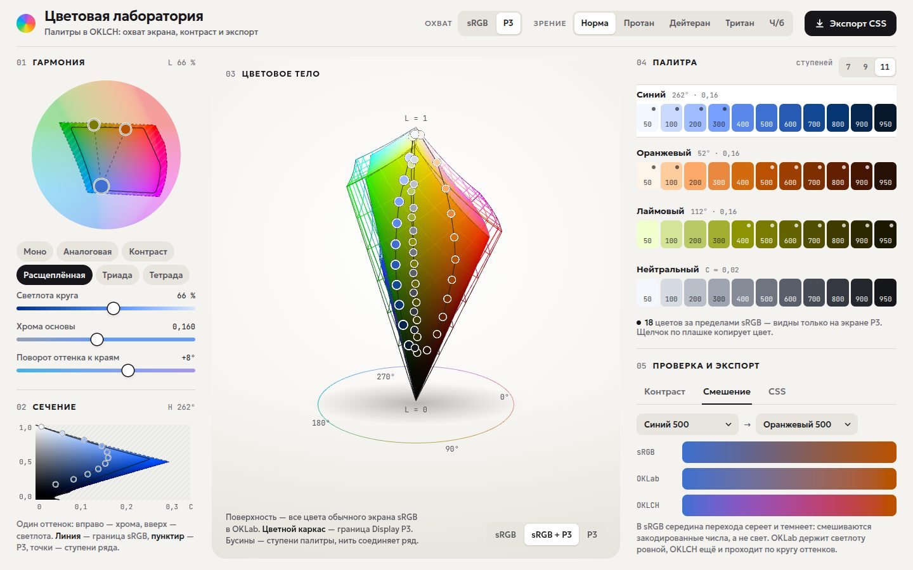

# 118 · Цветовая лаборатория

> Инструмент палитр в OKLCH: тело цветового охвата sRGB и Display P3 вращается в 3D, а палитра рядом уже готова к экспорту в CSS.

## Как запустить
Двойной клик по `index.html`. Интернет не нужен, без него вместо шрифтов Geologica и JetBrains Mono подставятся системные. Для трёхмерного вида нужен WebGL2; без него работает всё остальное.

## Что делать
- Перетаскивайте точки на круге оттенков. Главная точка задаёт оттенок и хрому, остальные следуют схеме гармонии: моно, аналоговая, контраст, расщеплённая, триада, тетрада. Если сдвинуть вторую точку, схема станет «своей».
- Ползунки: светлота среза на круге, хрома основы и поворот оттенка к краям ряда (светлые ступени поворачиваются на +N°, тёмные — на −N°). Число ступеней — 7, 9 или 11.
- **Охват**: sRGB или Display P3. В режиме P3 цвета за пределами sRGB отмечены точкой на плашке.
- **Зрение**: симуляция протанопии, дейтеранопии, тританопии и полной цветовой слепоты — меняются все цвета лаборатории, включая 3D.
- Цветовое тело вращается мышью или пальцем, колесо — масштаб. Наведите на бусину — увидите её цвет в `oklch()`.
- Вкладки: **Смешение** (один переход в sRGB, OKLab и OKLCH), **Контраст** (матрица «текст × фон» по WCAG 2 или APCA), **CSS** (переменные в `oklch()` с запасным hex, скачивание `.css` и `.json`).
- Щелчок по плашке копирует цвет, кнопка «Экспорт CSS» — всю палитру.

## Что внутри
- OKLab и OKLCH по формулам Бьёрна Оттоссона, матрицы перехода sRGB ↔ Display P3. Приведение к охвату — уменьшение хромы при той же светлоте и оттенке бинарным поиском.
- Ряд ступеней: светлота идёт от 97,5 % до 20,5 %, хрома максимальна в середине и спадает к краям, где насыщенных цветов не бывает.
- Цветовое тело — поверхность куба RGB, перенесённая в OKLab: 6 граней по 36 × 36 клеток, WebGL2, нормали по сетке и мягкий свет. Каркас P3 строится так же из куба Display P3. На экране с широким охватом холст рисует прямо в Display P3.
- Симуляция дальтонизма — матрицы Machado, Oliveira и Fernandes (2009) в линейном RGB: и в шейдере, и для плашек, круга и графиков.
- Контраст: WCAG 2 (отношение яркостей) и APCA 0.0.98G-4g (Lc).
- Сечение по оттенку показывает, почему насыщенный синий тёмен, а жёлтый светел: граница sRGB и P3 для выбранного оттенка по всей шкале светлоты.

## Почему это про Opus 5.5
Дизайн-инструмент, где под аккуратным интерфейсом — настоящая цветовая наука: перцептивное пространство, охваты экранов, модели цветового зрения и стандарты доступности.

## Ограничения
- Приведение к охвату — простое уменьшение хромы, а не полный алгоритм CSS Color 4 с порогом ΔE.
- Симуляция моделирует полную дихромазию; у большинства людей нарушение цветового зрения слабее.
- Порог APCA в матрице — упрощённый (Lc 60); полная методика учитывает кегль и насыщенность шрифта.
- На обычном мониторе цвета P3 обрезаются до sRGB: разницу видно только на экране с широким охватом.
