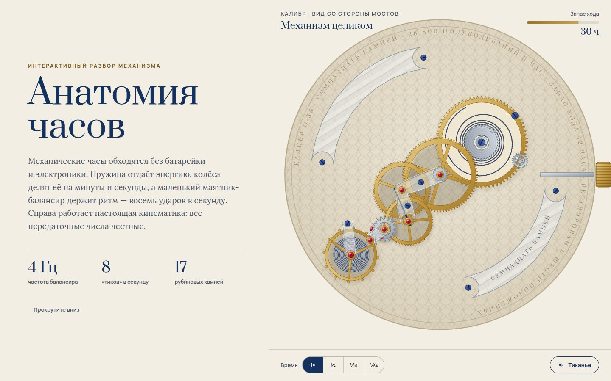

# 119 · Анатомия часов

> Интерактивный рассказ о механических часах: заводная пружина, колёсная система, спуск, балансир, камни, автоподзавод и точность.

## Как запустить
Двойной клик по `index.html`. Работает без интернета (шрифты заменятся системными).

## Что делать
- Прокручивайте главы: механизм справа сам приближает нужный узел и подписывает детали.
- Внизу — скорость времени: 1×, ¼, 1⁄16, 1⁄64. На 1⁄64 видны все фазы спуска.
- Глава I: тяните заводную головку или нажмите «Завести». «Спустить» — и балансир затихнет.
- Глава IV: переключайте частоту 18 000 / 21 600 / 28 800 / 36 000 пк/ч — секундная стрелка идёт шагами по 5, 6, 8 или 10 в секунду.
- Глава VI: тяните механизм или жмите «Встряхнуть» — ротор качается и подзаводит пружину.
- «Тиканье» — синтезированный звук каждого удара.

## Что внутри
- Колёса, трибы, анкерное колесо, вилка и балансир генерируются в SVG. Межосевые расстояния равны сумме делительных радиусов, поэтому зубья действительно сцеплены.
- Передаточные числа честные: барабан 72 → триб 12, центральное 80 → триб 10, промежуточное 75 → триб 10 (8 × 7,5 = 60), секундное 96 → анкерный триб 6 (×16). При 4 Гц анкерное колесо из 15 зубьев делает 16 оборотов в минуту.
- Кинематика спуска: колесо проворачивается на полшага зуба в окне импульса, когда балансир проходит ноль; вилка перекидывается; волосок «дышит» вместе с углом балансира.
- Запас хода расходуется, амплитуда падает с заводом; без завода механизм останавливается.

## Почему это про Opus 5.5
Ясное письмо плюс интерактивные диаграммы: сложный механизм объяснён по шагам, а числа в тексте совпадают с тем, что крутится на экране.

## Ограничения
- Кинематика спуска упрощена (без подъёма палет по плоскостям импульса), форма деталей стилизована.
- Показания таймграфера в главе VII — иллюстрация, а не измерение.
