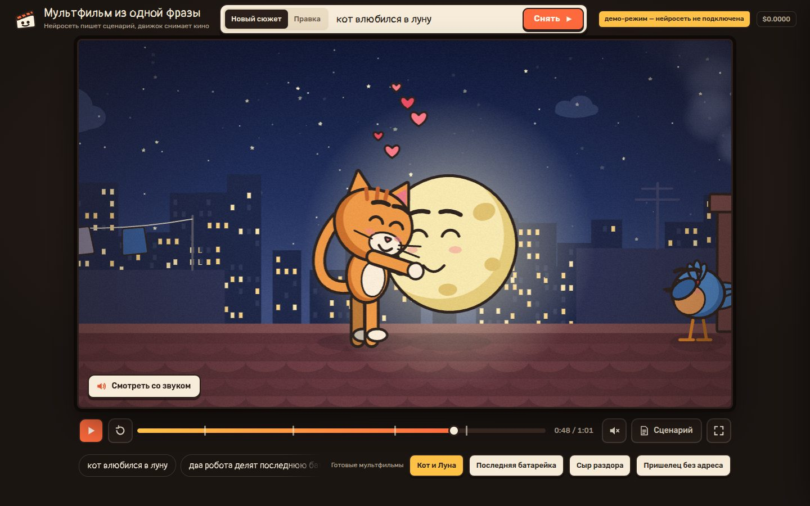

# 120 · Мультфильм из одной фразы

> Пишешь сюжет одной строкой — DeepSeek пишет сценарий на строгом языке сцен, а движок тут же снимает по нему мультфильм: куклы на суставах, камера, реплики в облачках и музыка.

## Как запустить
Двойной клик по `index.html`. Для новых сюжетов и правок нужен интернет и ключ OpenRouter (свой — BYOK: вход через OpenRouter или окно ввода ключа). Без сети или без ключа работает демо-режим: четыре готовых мультфильма, плеер, текст сценария и язык сцен. Шрифты грузятся с Google Fonts, без сети подставляется системный.

## Что делать
- Впишите сюжет («медведь боится темноты») и нажмите «Снять». Пока сценарист пишет (20–40 с), на экране крутится хлопушка.
- «Правка» — поправьте готовый фильм словами: «пусть кот будет злодеем», «добавь погоню», «сделай грустный финал». Нейросеть переписывает сценарий целиком и сохраняет героев.
- Плеер: пробел — пауза, ←/→ — ±5 с, шкала с метками сцен и перемоткой, повтор, полный экран. «Смотреть со звуком» запускает фильм с начала уже с музыкой.
- «Сценарий» — текст фильма и сам язык сцен (JSON). Его можно поправить руками и снять заново.
- Внизу — готовые мультфильмы и подсказки сюжетов.

## Что внутри
- **Язык сцен:** 10 мест × 3 времени суток, 14 кукол, 26 действий, 9 эмоций, 5 планов камеры, 9 настроений музыки, 15 предметов. Нейросеть отвечает строгим JSON, а `normalize()` сверяет каждое поле со словарём, понимает синонимы («дракон» → инопланетянин, «пекарня» → кухня) и чинит битое. Любой ответ, даже обрезанный, превращается в фильм.
- **Компилятор** раскладывает очередь действий в таймлайн: сегменты движения с easing, эмоции, реплики, реквизит (переходит из сцены в сцену), звуковые события. Кадр — чистая функция времени `t`, поэтому перемотка и пауза точные.
- **Режиссура по правилам:** общий план с наездом в начале сцены, план «в рост» на действиях, средние планы в диалогах, крупные — на сильных эмоциях. Куклы не встают друг в друга и подходят к партнёру со свободной стороны. Луну и солнце средний план не режет пополам. Диафрагма «Конец» закрывается на тех, кто в кадре.
- **Куклы** в стиле rubber hose на Canvas 2D: конечности-шланги, «кипящая» линия, сжатие-растяжение, упреждение, захлёст, 9 выражений лица. Живые фоны с параллаксом (крыша, кухня, свалка, космос…), переходы-ирисы и шторки, облачка реплик печатаются по буквам.
- **Звук** синтезируется на Web Audio: гармония, бас, мелодия и ударные по настроению каждой сцены, «бормотание» персонажей под реплики, шаги, падения, объятия.
- **Нейросеть:** `deepseek/deepseek-v4.1-flash` с рассуждением, одна генерация стоит около $0,002–0,003, счётчик в шапке. Если ответ не пришёл, хлопушка называет причину и предлагает «Повторить дубль».

## Почему это про Opus 5.5
Opus 5.5 спроектировал язык, на котором другая нейросеть может «снимать кино», и весь конвейер вокруг него: проверку по схеме, компилятор мизансцены и камеры, кукольный движок и синтезатор. Поэтому даже неряшливый ответ модели становится связным мультфильмом.

## Ограничения
- Набор кукол, мест и действий фиксирован: дракон станет зелёным инопланетянином, лиса — собакой по имени Лиса.
- Сценарий пишется 20–40 секунд: модель рассуждает перед ответом.
- Камера и мизансцена выбираются правилами, а не пониманием кадра. На крупном плане соседа иногда срезает край, а «взять» без указания предмета превращается в жест.
- Голоса — синтезированное бормотание, не речь. Реплики только в облачках.
- В демо-режиме правки словами недоступны: для них нужны ключ и сеть.
