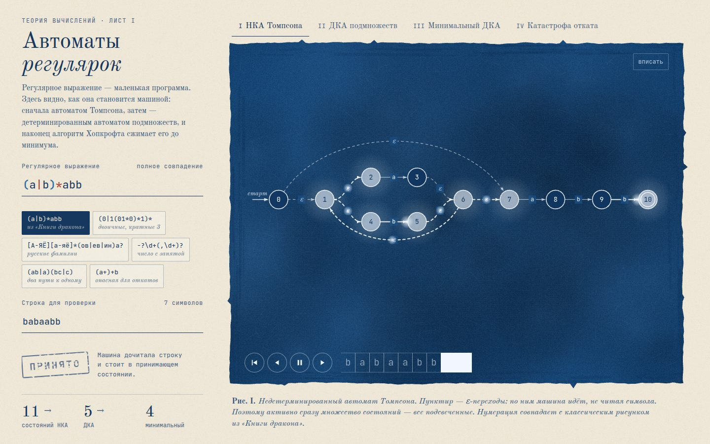

# 121 · Автоматы регулярок

> Регулярное выражение превращается в машину у вас на глазах: автомат Томпсона, детерминированный автомат подмножеств, минимальный автомат Хопкрофта. И отдельная глава о том, почему движки с откатами иногда «зависают».

## Как запустить
Двойной клик по `index.html`. Интернет нужен только для шрифтов (Old Standard TT и JetBrains Mono); без него работают системные.

## Что делать
- Впишите регулярное выражение и строку — все три автомата перестроятся мгновенно. Поддерживаются `|`, `*`, `+`, `?`, `{n,m}`, скобки, классы `[а-яё]`, `[^…]`, точка, `\d`, `\w`, `\s`.
- Готовые примеры: `(a|b)*abb` из «Книги дракона», двоичные числа, кратные трём, русские фамилии, число с запятой.
- Вкладки I–III: НКА, ДКА, минимальный ДКА. Лента внизу проигрывает сопоставление: пробел — пуск и пауза, ← → — шаг. Колесо — зум, перетаскивание — сдвиг, «вписать» — вернуть вид.
- Наведите курсор на состояние ДКА — увидите, какому множеству состояний НКА оно соответствует.
- Вкладка IV «Катастрофа отката»: папоротник из всех попыток движка с возвратами для `(a+)+b` и график шагов в сравнении с автоматом.

## Что внутри
- Собственный парсер регулярных выражений (рекурсивный спуск) и разбиение алфавита на классы символов, которые выражение не различает. Поэтому кириллица и классы вроде `[^abc]` работают без перебора всех символов Unicode.
- Конструкция Мак-Нотона — Ямады — Томпсона: конкатенация склеивает состояния, как в учебнике. Для `(a|b)*abb` получаются ровно 11 состояний с классической нумерацией 0–10, ДКА A–E и минимальный автомат из 4 состояний.
- Алгоритм подмножеств с ограничением на 300 состояний (для экспоненциального взрыва выводится пояснение) и минимизация Хопкрофта с разбиением на блоки.
- Движок с откатами на продолжениях считает шаги честно и показывает рост 2ⁿ. Автомат для той же задачи делает линейное число шагов.
- Раскладка графа по слоям: длиннейший путь плюс упорядочивание по барицентрам. Рёбра — кривые Безье, по ним в момент перехода бегут «фотоны».
- Отпечаток-цианотипия генерируется процедурно: рваный край от кисти, пятна неровной засветки, зерно и волокна бумаги.

## Почему это про Opus 5.5
Три классических алгоритма теории вычислений и визуализация написаны с нуля и сверены с настоящим `RegExp` на наборе тестов. Это длинная инженерная задача, где важна и корректность, и вкус.

## Ограничения
- Всегда проверяется полное совпадение строки (как `^…$`). Обратные ссылки, опережающие проверки и ленивые квантификаторы автоматами не выражаются, поэтому их нет.
- `\w` здесь включает русские буквы (в JavaScript — нет).
- Повторы `{n,m}` ограничены двенадцатью, чтобы граф оставался читаемым.
